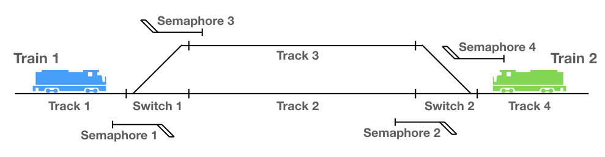

# A Simple Train Siding Modeled in TLA+
In this project, I model a simple train siding and how two trains can pass each other on it. 
I start with a simple model in file *01_TrainSiding_StraightLine.tla*. Then I improve it step by step until in file *09_TrainSiding_ConflictResolution.tla* all errors are resolved.

If you want to learn how I developed this model, read [this article](https://www.heinbockel.eu/2019/12/08/train-sidings-a-tla-example/).
